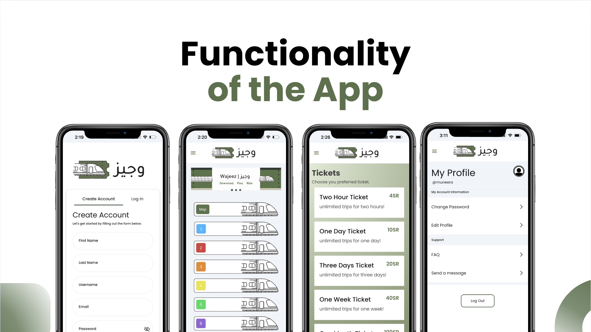

# 🚇 Wajeez – Riyadh Metro Integrated System

Wajeez is a mobile application developed to enhance the Riyadh Metro experience through a unified digital platform for ticket purchasing, metro navigation, passenger support, and emergency communication.

The project was developed as part of the Software Engineering curriculum at Imam Mohammad Ibn Saud Islamic University using Agile development practices and iterative sprint planning.

---

## Overview

Wajeez simplifies metro commuting by providing passengers with easy access to ticketing services, metro information, route planning, and account management through a user-friendly mobile application.

The system focuses on improving accessibility, convenience, and user experience while maintaining security and reliability.

## Application Overview

---

## Key Features

### User Account Management
- User Registration
- Secure Login
- Password Recovery (OTP Verification)
- Profile Management
- Account Deletion

### Ticketing System
- Purchase Metro Tickets
- Multiple Ticket Purchases
- Promo Code Validation
- Ticket History Management
- Ticket Transfer
- PDF Ticket Generation

### Metro Information
- Metro Line Information
- Station Browsing
- Train Schedule Access
- Route Generation

### Notifications & Alerts
- Emergency Notifications
- Metro Service Updates

### Customer Support
- FAQ Section
- In-App Messaging Support

### Additional Features
- Savings Tracking
- Multi-language Support

---

## System Architecture

The application follows a Layered Architecture approach to improve maintainability, scalability, and separation of concerns.

Benefits include:

- Scalability
- Component Reusability
- Easier Maintenance
- Independent Testing
- Improved Security

---

## Technology Stack

### Frontend
- FlutterFlow
- Flutter

### Backend & Database
- Supabase
- PostgreSQL

### Authentication
- Supabase Authentication
- OTP Verification

### CI/CD & Quality Tools
- GitHub
- CodeMagic
- Code Climate

---

## Software Engineering Practices

The project was developed using:

- Agile Methodology
- Sprint Planning
- Product Backlog Management
- Risk Management
- System Modeling (Use Cases, Class Diagrams, Activity Diagrams, Sequence Diagrams)
- Continuous Improvement

---

## Quality Assurance

### Reliability Testing
- 200 request reliability evaluation
- Response time measurements
- Reliability metrics analysis

### Security Enhancements
- OTP Verification
- Authentication Controls
- Data Protection Measures

### Testing Techniques
- White-Box Testing
- Control Flow Graph Analysis
- Cyclomatic Complexity Analysis
- Black-Box Testing
- Boundary Value Analysis (BVA)

### Code Quality
- Code Climate Analysis
- Maintainability Rating Evaluation

---

## Repository Structure

text android/        Android platform files ios/            iOS platform files lib/            Application source code assets/         Images and application resources web/            Web deployment files test/           Testing resources 

---

## Team

- Muneera AlSaeed
- Ghala AlOtaibi
- Norah AlDakheel
- Joury AlAnazi
- Nada AlNashwan

---

## Academic Project

This project was developed as part of the Software Engineering courses at:

College of Computer and Information Sciences  
Imam Mohammad Ibn Saud Islamic University
